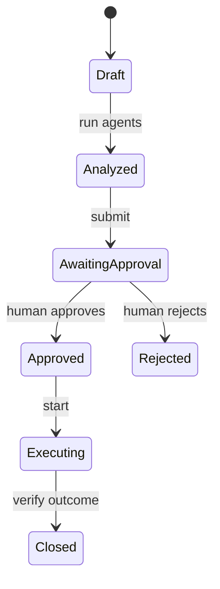

# Agentic AI Project Office

[](https://github.com/Lonfea/agentic-ai-project-office/actions/workflows/ci.yml)


A governed multi-agent workflow for project intake, portfolio prioritization, risk review, workshop preparation and top-management reporting. The demo is deterministic and runs without paid APIs; an LLM can later be added behind the same approval boundary.

> Independent portfolio project using synthetic initiatives. Not affiliated with Infineon.

## Agents

- **Intake agent:** validates objectives, owners, benefits and deadlines
- **Strategy agent:** maps initiatives to strategic themes and calculates transparent priority
- **Risk agent:** identifies delivery, dependency, adoption and governance risks
- **Facilitation agent:** produces workshop agenda and decision questions
- **Reporting agent:** creates a management-ready portfolio brief
- **Governance controller:** enforces approval gates, allowed transitions and append-only audit events



## Production characteristics

- Idempotent workflow operations
- Human approval before execution
- Append-only, hash-chained audit log
- Explainable priority and risk components
- Policy checks that fail closed
- Deterministic evaluation suite
- FastAPI, Streamlit, Docker and CI

## Run

```bash
python -m venv .venv && source .venv/bin/activate
pip install -e '.[dev]'
pytest
uvicorn project_office.api:app --reload
streamlit run src/project_office/dashboard.py
```

See [governance and evaluation](docs/governance.md).

